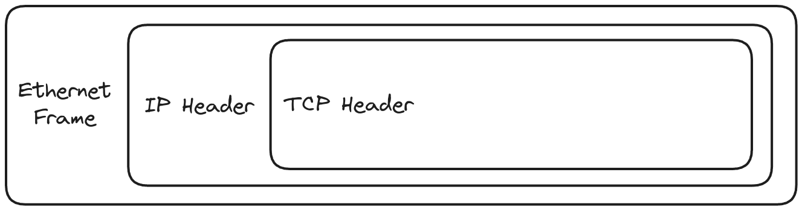

# eBPF Lab

## Drop all packets on a specific port

> `eBPF` program to drop the TCP packets on a port (def: 4040). The port
> number is configurable from the userspace.



```sh
GOPROXY=direct go install github.com/murtaza-u/ebpf-lab/cmd/drop@latest
drop -h

# remember to run with sudo and make necessary changes to the
# interface and port.
sudo drop --interface wlp1s0 --port 80
```

Demo: [Link](https://imgur.com/PISJUlN)
